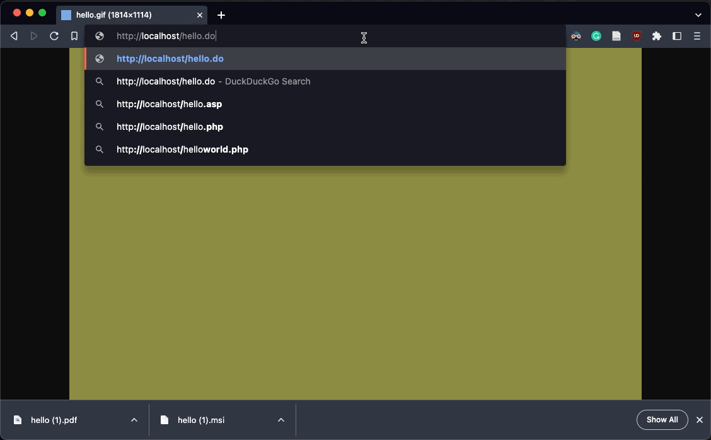

# GHOSTS PANDORA SERVER Overview

???+ info "Pandora is part of GHOSTS"
    [Pandora is within the GHOSTS Source Code Repository](https://github.com/cmu-sei/GHOSTS/tree/master/src/ghosts.pandora) hosted on GitHub.

GHOSTS PANDORA is a web server that responds to a myriad of request types with randomized content generated in real-time. It can operate in two modes:

1. **Standard Mode** - Serves randomly-generated content for various file types (HTML, PDF, Office documents, images, etc.)
2. **Social Mode** - Enables POST/PUT/DELETE operations for social media simulation where NPCs can share content, images, and interact with each other

The mode is controlled by configuration, making Pandora a unified content server for all GHOSTS content generation needs. Used in conjunction with [GHOSTS](https://github.com/cmu-sei/GHOSTS) NPCs, Pandora provides agents with realistic content to download, post, and interact with beyond simple HTML and associated image, CSS, and js files.



## Running this server

### As a Docker Container

Docker is the preferred way to run Pandora - mostly because this is how we run and test it before version releases.

1. Review the repository [docker-compose.yml](https://raw.githubusercontent.com/cmu-sei/GHOSTS/master/src/ghosts.pandora/docker-compose.yml) file
2. Run the following in your terminal 

```cmd
mkdir ghosts-pandora
cd ghosts-pandora
curl https://raw.githubusercontent.com/cmu-sei/GHOSTS/master/src/ghosts.pandora/docker-compose.yml -o docker-compose.yml
docker-compose up -d
```

### Bare metal

This assumes the host server is a common Linux distribution. For images to render correctly, PIL or the more recent Pillow library is necessary. See here for more information on [Pillow installation and configuration](https://pillow.readthedocs.io/en/latest/installation.html).

1. Using a Python 3 distribution >= 3.6.2
2. In the terminal run: `pip install -r requirements.txt`
3. Then run `python app.py`

## Capabilities

### Handling requests by directory

- **/api** - All requests beginning with `/api` automatically respond with json. This includes:
    - `/api/users`
    - `/api/user/a320f971-b3d9-4b79-bb8d-b41d02572942`
    - `/api/reports/personnel`
- **/csv** - All requests beginning with `/csv` automatically respond with csv. Like the above, this includes urls such as:
    - `/csv/users`
    - `/csv/user/winx.jalton`
    - `/csv/reports/HR/payroll`
- **/i, /img, /images** - All requests beginning with these directories automatically respond with a random image of type [gif, jpg, png]. Examples:
    - `/i/v1/a9f6e2b7-636c-4821-acf4-90220f091351/f8f8b1f0-9aa5-4fc7-8880-379e3192748e/small`
    - `/images/products/184f3515-f49b-4e07-8c8b-7f978666df0e/view`
    - `/img/432.png`
- **/pdf** - All requests respond with a random pdf document. Examples:
    - `/pdf/operations/SOP_Vault/a7f48bd5-84cb-43a1-8d3d-cd2c732ddff6`
    - `/pdf/products`
- **/docs** - All requests respond with a random word document
- **/slides** - All requests respond with a random powerpoint document
- **/sheets** - All requests respond with a random excel document

### Handling requests by type

For requests indicating a specific file type, there are several specific handlers built to respond with that particular kind of file, such as:

- .csv
- Image requests [.gif, .ico, .jpg, .jpeg, .png]
- .json
- Office document requests
  - .doc, .docx
  - .ppt, .pptx
  - .xls, .xlsx
- .pdf

So that a URL such as `/users/58361185-c9f2-460f-ac45-cb845ba88574/profile.pdf` would return a pdf document typically rendered right in the browser.

All unhandled request types, urls without a specific file indicator, or requests made outside specifically handled directories (from the preceding section) are returned as html, including:

- `/docs/by_department/operations/users`
- `/blog/d/2022/12/4/blog_title-text`
- `/hello/index.html`

## Social Mode

When configured for social media simulation, Pandora enables NPCs to interact with a realistic social platform. Social mode supports:

| Request                                                                       | Response                                                                      |
| ----------------------------------------------------------------------------- | ------------------------------------------------------------------            |
| `POST` /images                                                                | :material-check: responds with a url to the saved image file                  |
| `POST` /                                                                      | :material-check: responds with a randomly-generated streamed video            |
| `POST` /users/michelle_smith/af2d00aa-4a89-4af3-baff-1746b556e7a1/            | :material-check: responds with a reply to the original user's social post     |

**Configuration:**

Switch between standard and social mode by setting the appropriate environment variables or configuration file settings. See the repository's configuration examples for details on toggling social mode features.

## Hiding malicious payloads for red-teaming

Pandora also can hide payloads in a particular request for things like red-teaming and such. This is done in the configuration file, and looks like this:

```config

[payloads]
1=/1/,a.zip,application/zip
2=/2/users,b.zip,application/zip
3=/3/some/report/url,c.zip,application/zip
```

Each record must be an incrementing integer with no duplication. The values are:

- The URL that this payload responds to
- The local file (stored in `./payloads/`) to be returned
- The MIME type of the response

So for 1 in the example above, requests to /1/ return the a.zip file as an application/zip file.
