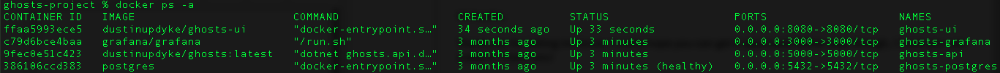
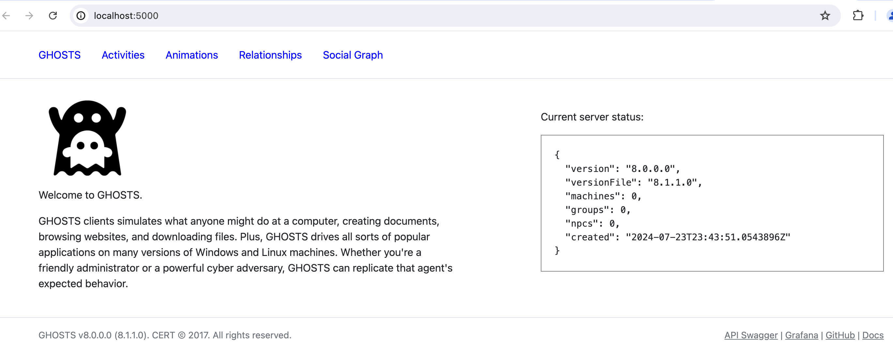
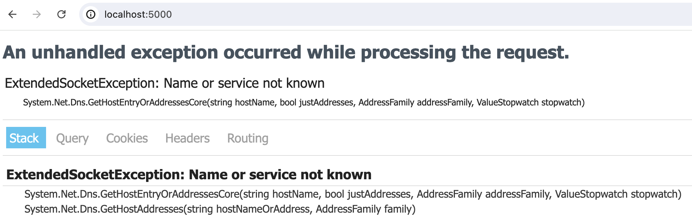
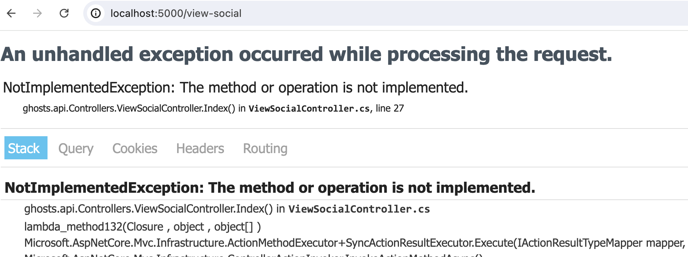

# Setting Up the GHOSTS API

_Updated on October 30, 2024_

The GHOSTS API enables the control and orchestration of non-player characters (NPCs) within a deployment. It supports logging, reporting, and managing individual, groups of, or entire deployments of client installs.

The GHOSTS API consists of three components: the API itself for configuring and managing characters and machines, a Postgres database for managing all the pieces, and Grafana for seeing GHOSTS activities in one convenient dashboard. Each of these three components runs in its own docker container.

Steps to set up the GHOSTS API:

1. Choose where to host the API
2. Install Docker and Docker Compose
3. Build the GHOSTS containers
4. Test the API

## Step 1 &mdash; Choose Where to Host the API

Choose the machine you'll be using to host the GHOSTS API. If you're just playing around with the GHOSTS, your local machine is fine. If you're configuring an exercise or simulation that other people might care about, consider creating a dedidicate host (server, image, or virtual server) for the API, or even using a container service such as AWS ECS.

## Step 2 &mdash; Installing Docker

You'll need to install Docker and Docker Compose on your API host.

First, **install 🐳 [Docker](https://docs.docker.com/install/)**.

Next, **install [Docker Compose](https://docs.docker.com/compose/install/)** which will assist with starting up multiple containers at the same time.

Before continuing, test that you have the command for Docker Compose available.

Open your system's CMD (Linux), Terminal (Mac), or PowerShell (Windows).

```
$ docker-compose --version
```

## Step 3 &mdash; Installing the GHOSTS API

Once you have confirmed that Docker and Docker Compose are installed, you can build the containers required for the GHOSTS API.

Create a directory where you want to store the build files and containers.

```shell
mkdir ghosts-project
cd ghosts-project
```

Download the docker compose file for GHOSTS.

```shell
curl https://raw.githubusercontent.com/cmu-sei/GHOSTS/master/src/Ghosts.Api/docker-compose.yml -o docker-compose.yml
```

Build all of the containers at once using docker-compose.

```
docker-compose up -d
```

Check for the running containers.

```
docker ps -a
```

If everything succeeds you should see four new containers for the API, UI, Grafana, and Postgres.



## Step 4 &mdash; Testing the API

By default, the API is hosted on port 5000. You should be able to reach the API from [http://localhost:5000](http://localhost:5000). If you open this page in your browser, you should see the initial API page outlining the version of the install, and a few test machine entries. If this page renders, your API is up, running, and available.



## Troubleshooting

### Problem: The API home page has an error



Answer: Make sure the docker container for Postgres is running using Docker Desktop or the command `docker ps -a`


You can check the logs with the command `docker logs ghosts-postgres` to look for container errors.

### Problem: The social graph link has an error



Answer: You haven't created a social network yet, this is normal.
