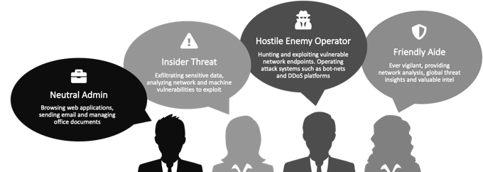

# GHOSTS Client Overview

???+ info "GHOSTS Source Code"
    The [GHOSTS Source Code Repository](https://github.com/cmu-sei/GHOSTS) is hosted on GitHub.

The GHOSTS client simulates realistic human activities on a computer based on specific roles or memberships within a team. It creates documents, browses websites, downloads files, and interacts with various applications on Windows and Linux machines. GHOSTS is useful for cyber training, exercises, and testing scenarios.



GHOSTS can be used for training, testing, or generating datasets by simulating realistic computer and network activities.

???+ warning "Do I need the API?"
    The API server is optional but provides logging, reporting, and remote administration features. Without the API, client management must be handled through other means such as Ansible or similar.

The GHOSTS client should be run as a regular user, not as an administrator or root, to accurately simulate user behavior.

## The Windows Client

GHOSTS on Windows (supporting Win7, 10, 11, and corresponding server versions) is a .NET Console application that performs various user activities. Install the client in a directory like `c:\exercise\ghosts\`. Verify one client before deploying to multiple machines and configure it with the API base URL.

### Windows Installation

- Ensure the [Microsoft DotNet 4.6.1 runtime](https://go.microsoft.com/fwlink/?LinkId=2099467) is installed.
- [Download the latest client](https://github.com/cmu-sei/GHOSTS/releases/latest) and unzip it to `c:\exercise\ghosts`.
- Adjust `config/application.json` to point to your API server.
- Run the executable at `c:\exercise\ghosts\ghosts.exe` to setup and start GHOSTS.

???+ info "Additional configuration required for web browsing"
    For Firefox or Chrome web browsing, download the appropriate automation driver: [Geckodriver](https://github.com/mozilla/geckodriver/releases) for Firefox or [Chromedriver](https://chromedriver.chromium.org/downloads) for Chrome.

???+ info "Additional configuration required for email"
    Email functions require the [Redemption library](http://www.dimastr.com/redemption/home.htm) found in `/lib` this provides Outlook automation.

???+ info "Additional configuration required for RDP"
    RDP Handlers require [registering AutoIt dlls](https://github.com/cmu-sei/GHOSTS/issues/429#issuecomment-2403269945).

## Linux Client

GHOSTS on Linux requires the [Microsoft dotnetcore runtime version 8.0](https://dotnet.microsoft.com/download). We have tested with Ubuntu 24.04 using the [snap instructions here](https://learn.microsoft.com/en-us/dotnet/core/install/linux-ubuntu-install?pivots=os-linux-ubuntu-2404&tabs=dotnet8), but other distributions should work.

### Linux Installation

- [Download the latest Linux client](https://github.com/cmu-sei/GHOSTS/releases/latest) and unzip it to a folder such as `~/ghosts`.
- Running the client as root may cause display issues with web browsers.

### Linux Service Configuration

To ensure the GHOSTS client runs automatically on system startup, you can configure it as a service using `systemd`.

#### Step 1: Create the Service File

Create a new service file for the GHOSTS client by running the following command:

```bash
sudo nano /etc/systemd/system/ghosts.service
```

#### Step 2: Define the Service

Paste the following content into the service file:

```ini
[Unit]
Description=GHOSTS Client Service
After=network.target

[Service]
ExecStart=/usr/bin/dotnet /path/to/ghosts/ghosts.client.linux.dll
WorkingDirectory=/path/to/ghosts
Restart=always
User=ghosts_user
Group=ghosts_user
Environment=DOTNET_CLI_TELEMETRY_OPTOUT=1
Environment=DISPLAY=:0

[Install]
WantedBy=multi-user.target
```

- Replace `/path/to/ghosts` with the actual path where the GHOSTS client is installed.
- Replace `ghosts_user` with the user under which the GHOSTS client should run.

#### Step 3: Reload systemd and Enable the Service

After creating the service file, reload `systemd` to recognize the new service:

```bash
sudo systemctl daemon-reload
```

Enable the service to start on boot:

```bash
sudo systemctl enable ghosts
```

#### Step 4: Start the Service

To start the service immediately, run:

```bash
sudo systemctl start ghosts
```

You can check the status of the service with:

```bash
sudo systemctl status ghosts
```

#### Step 5: Stopping and Restarting the Service

To stop the service:

```bash
sudo systemctl stop ghosts
```

To restart the service:

```bash
sudo systemctl restart ghosts
```

Now, the GHOSTS client will run as a background service and automatically start with your system.

## Client Directory Structure

???+ danger "Do not copy the instance folder"
    The `instance` folder should not be copied between machines.

| Folder          | Description                            |
| --------------- | ---------------------------------------|
| `config/`       | Configuration files are stored here. |
| `instance/`     | Stores files and information specific to the instance. **Do not copy this folder** |
| `lib/`          | Third-party libraries used by GHOSTS |
| `logs/`         | Output logs for the client and logs transferred to the server |

## Configuration Quick Start

After unzipping, run the client by double-clicking it. The console window may briefly appear and then disappear. To verify, check Windows Task Manager or use the `kill-ghosts.bat` script to close it.

### application.json

Adjust the API URLs in `application.json` to point to your server:

```json
{
  "ApiRootUrl": "http://localhost:5000/api",
  "Sockets": {
    "IsEnabled": true,
    "Heartbeat": 50000
  },
  "Id": {
    "IsEnabled": true,
    "Format": "guestlocal",
    "FormatKey": "guestinfo.id",
    "FormatValue": "$formatkeyvalue$-$machinename$",
    "VMWareToolsLocation": "C:\\progra~1\\VMware\\VMware Tools\\vmtoolsd.exe"
  },
  "AllowMultipleInstances": false,
  "EncodeHeaders": true,
  "ClientResults": {
    "IsEnabled": true,
    "IsSecure": false,
    "CycleSleep": 300000
  },
  "ClientUpdates": {
    "IsEnabled": true,
    "CycleSleep": 300000
  },
  "Survey": {
    "IsEnabled": false,
    "IsSecure": false,
    "Frequency": "once",
    "CycleSleepMinutes": 5,
    "OutputFormat": "indent"
  },
  "Timeline": {
    "Location": "config/timeline.json"
  },
  "Content": {
    "EmailsMax": 20,
    "EmailContent": "",
    "EmailReply": "",
    "EmailDomain": "",
    "EmailOutside": "",
    "BlogContent": "",
    "BlogReply": "",
    "FileNames": "",
    "Dictionary": ""
  },
  "ResourceControl": {
    "ManageProcesses": true
  },
  "HealthIsEnabled": false,
  "HandlersIsEnabled": true,
  "DisableStartup": false
}
```

---

### `timeline.json`

The `timeline.json` file defines the agent’s daily tasks, such as browsing websites, creating documents, and executing commands. The default settings provide a solid starting point, showcasing a variety of possible configurations. However, the customization options are vast—so feel free to experiment and tailor the setup to suit your needs.

The key field in each timeline entry is the **`HandlerType`**, which specifies the task GHOSTS should perform. These tasks might include running commands (`Command`), browsing websites using Firefox or Chrome (`BrowserFirefox`, `BrowserChrome`), or creating documents in Excel or Word. Below are some other important configuration options:

- **`Initial`**: Defines the first action the handler will execute. For web browsers, this can be a URL (e.g., `http://example.com`) or "about:blank" to start with an empty tab.
- **`UtcTimeOn` | `UtcTimeOff`**: Specifies the time window during which the task is active. `"00:00:00"` to `"24:00:00"` will run the task continuously, but you can customize the times to simulate real-world office hours, such as 9 to 5. A random jitter of up to 30 minutes is applied to these times.
- **`Loop`**: Set this to `true` if you want the task to repeat, or `false` if it should run only once.

#### Example Commands

To execute specific tasks, you can use various system commands, such as:

- **Access a Network Share**:
  ```bash
  net use X:\SERVER\Share
  ```
  
- **Remote Desktop (RDP) Connection**:
  ```bash
  mstsc.exe {ConnectionFile | /v:ServerName[:Port]} [/console] [/f] [/w:Width/h:Height]
  ```
  - `/v`: Specifies the remote machine and port (optional).
  - `/console`: Connects to the console of a Windows Server 2003 or later.
  - `/f`: Launches RDP in full-screen mode.
  - `/w` & `/h`: Set the width and height of the RDP window.

File operations, such as copying, moving, or deleting files, can also be configured using standard system commands.

#### Browser Configuration

When configuring the browser handlers (Chrome or Firefox), an initial value is required. This could be "about:blank" if you don’t want to load a page immediately or an actual URL. Both HTTP and HTTPS are supported.

##### Example Configuration for Chrome:
```json
{
   "HandlerType": "BrowserChrome",
   "Initial": "http://google.com",
   "UtcTimeOn": "00:00:00",
   "UtcTimeOff": "24:00:00",
   "Loop": true,
   "TimeLineEvents": [
      {
         "Command": "random",
         "CommandArgs": [
            "http://google.com",
            "http://facebook.com"
         ],
         "DelayAfter": 1000,
         "DelayBefore": 0
      }
   ]
}
```

#### Document Creation

You can also configure GHOSTS to create documents in Word, Excel, or PowerPoint. Here’s an example for Word:

```json
{
   "HandlerType": "Word",
   "Initial": "",
   "UtcTimeOn": "00:00:00",
   "UtcTimeOff": "24:00:00",
   "Loop": true,
   "TimeLineEvents": [
      {
         "Command": "create",
         "CommandArgs": [ "%homedrive%%homepath%\\Documents" ],
         "DelayAfter": 900000,
         "DelayBefore": 0
      }
   ]
}
```

### Trackables

If you need to track the outcome of a specific timeline event (such as verifying that a client machine performed an action), you can use the **`TrackableId`**. Here's an example of tracking a file download:

```json
{
    "TimeLineHandlers": [
        {
            "HandlerType": "BrowserChrome",
            "Initial": "about:blank",
            "UtcTimeOn": "00:00:00",
            "UtcTimeOff": "24:00:00",
            "Loop": false,
            "TimeLineEvents": [
                {
                    "Command": "browse",
                    "CommandArgs": [ "https://dl.dafont.com/dl/?f=italian_breakfast" ],
                    "DelayAfter": 0,
                    "DelayBefore": 0
                },
                {
                    "Command": "download",
                    "CommandArgs": [ "//a[contains(@class, 'dlbutton')]" ],
                    "DelayAfter": 0,
                    "DelayBefore": 0
                }
            ]
        }
    ]
}
```

---

## Troubleshooting

### Clients aren't running (immediately exiting, throwing exceptions, etc.)

- **.NET Framework**: Is the .NET Framework runtime 4.x installed on the machine?
- **GPO Whitelisting**: If GPO is whitelisting apps, is `ghosts.exe` on the whitelist?
- **Manual Execution**: Does the client run when you double-click the `.exe` file?
- **Event Logs**: Are there any reports in the Windows application event logs?
- **Logs**: What’s in `logs/app.log`?
- **Startup**: Is the `ghosts.exe` set to execute automatically when the machine restarts?
- **NLog Configuration**: Does the `nlog.config` contain these lines?

```xml
<AutoLoadExtensions="true"/>
<internalLogToConsole="true"/>
<internalLogFile="logs/nlog-internal.log"/>
<internalLogLevel="Error"/>
```

  - Ensure the `internalLogFile="logs/nlog-internal.log"` exists.

### Clients aren't reporting their activity to the API

- **Client Status**: Is the client running correctly? (If not, see the steps above.)
- **Client Logs**: Check the `logs/clientupdates.log` file. Is it too large? (If so, try deleting it; GHOSTS might be stuck processing too much log data.)
- **Instance/ID**: Has the folder `instance` been created? Does `instance/id.json` exist? (If this file has an ID, GHOSTS has reported to the API at least once.)
- **App Log**: Check `logs/app.log` for any fatal issues. (Logging levels can be adjusted in `nlog.config`.)

### Can I update what clients are doing?

- **Timeline Updates**: Clients operate based on their `config/timeline.json` file. You can update this file using PowerShell, Ansible, or similar tools. It’s just a file.
- **Just-In-Time Activities**: Clients also support just-in-time activities. Any files placed in the `instance/timeline/in` folder will be picked up, executed, and then moved to the `out` folder once complete. This doesn’t affect the default timeline.

### Can I reset a client on a machine?

Yes, launching a new instance of GHOSTS will automatically kill the previous one along with all associated tasks (e.g., Word, PowerShell instances). Only one instance of GHOSTS will run on a client machine at a time. You can also run the `kill-ghosts.bat` script, included in the distribution, to clean up any previous instances.

### Determining the running version of the client

You can check the client version by running:

```bash
ghosts.exe --version
```
