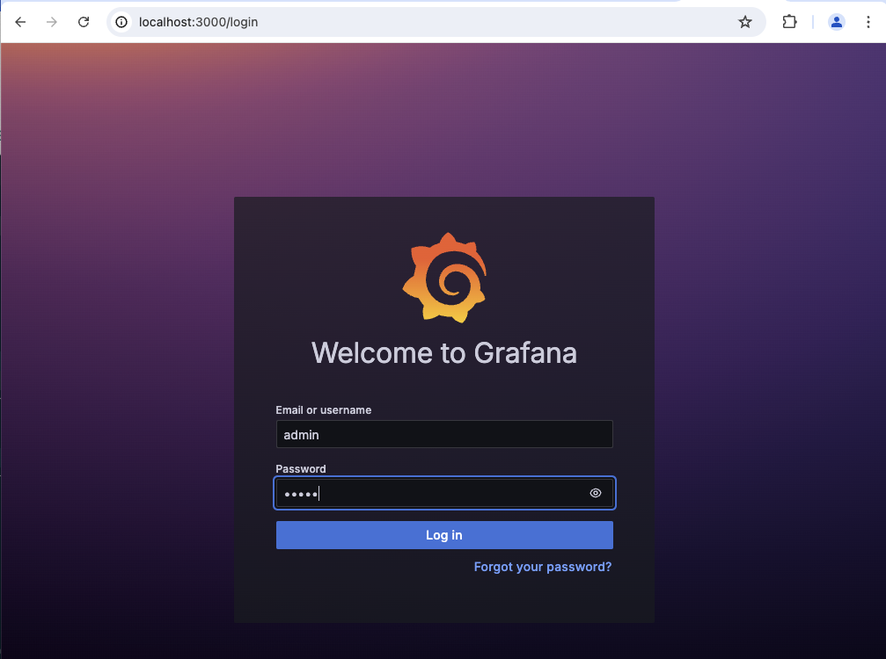
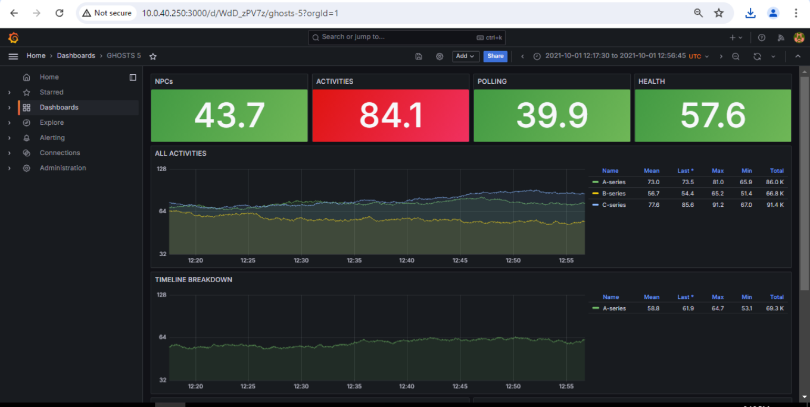

# Configuring Grafana

_Updated on October 30, 2024_

[Grafana](https://grafana.com/) for GHOSTS allows the simulation administrator to visualize all activities carried out by the NPCs across the simulation in dashboard with pretty colors and charts.

## Prerequisites

-   Your GHOSTS API should be installed and running (see [Setting Up the GHOSTS API](installing-the-api.md))

## Step 1 &mdash; Container Set Up

The Grafana docker container will be installed during the process of [Setting Up the GHOSTS API](installing-the-api.md). Depending on your system and account, the Grafana container may or may not have the permissions it needs to run.

You can check its status with the docker command

```
docker ps -a
```

If the container is continuously restarting, Grafana does not have the permissions it needs.


You can also check the docker logs:

```
docker logs ghosts-grafana
```


If you don't see this issue, you can continue to Step 2. If you do see this issue you will need to grant permissions on the `_g` directory of the ghosts-api folder (which stores the Grafana data for the GHOSTS API).

```shell
cd ghosts-api
chmod 777 _g
```

Ensure the container is running with `docker ps`.

## Step 2 &mdash; Configuring Grafana

Once the container is running you can access its front end by default at [localhost:3000](http://localhost:3000)



The default login is:

| Username | Password |
| -------- | -------- |
| admin    | admin    |

Continue through the setup prompts.

### Step 3 &mdash; Setting the Datasource

Now you need to tell Grafana where it will be getting its data.

1. From the "Connections" drop down menu on the left side, choose the "Data Sources" option
2. Click the "Add new data source" button
3. Search for "Postgres" and choose the PostgreSQL option
4. Name the datasource "ghosts" and leave it as the default
5. Under the "Connection" section of the config, set

-   host url to "ghosts-postgres:5432"
-   database name to "ghosts"

6. Under the "Authentication" section of the config, set

-   username to "ghosts"
-   password to "scotty@1"
-   TLS/SSL Mode to "disable"

7. Leave everything else at its default and click the "Save and test" button at the bottom of the page

### Step 4 &mdash; Choosing a Dashboard

Grafana dashboards are very flexible and can be configured to show any statistics that are important to your simulation or experiment.

GHOSTS comes with some premade dashboards to get you started. You can download those here: https://github.com/cmu-sei/GHOSTS/tree/master/configuration/grafana/dashboards

-   GHOSTS-5-default Grafana dashboard &mdash; shows status across all machines
-   GHOSTS-5-group-default Grafana dashboard &mdash; shows status with machines grouped by enclave

#### Loading an existing dashboard

Navigate to "Dashboards" in the left menu. There will be a blue "New" button in the top right corner.


Click "New". Then, "import".

You can either upload one of the dashboard json files from the [GHOSTS repository](https://github.com/cmu-sei/GHOSTS/tree/master/configuration/grafana/dashboards) or simply copy and paste the json into the "import via dashboard json model" panel.

Choose the ghosts datasource you added earlier from the drop down menu and then click "import".



You are now set up with Grafana!
