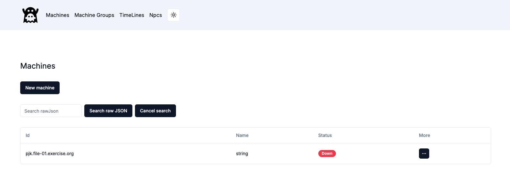
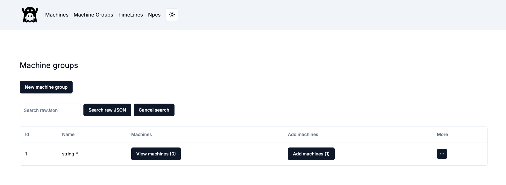
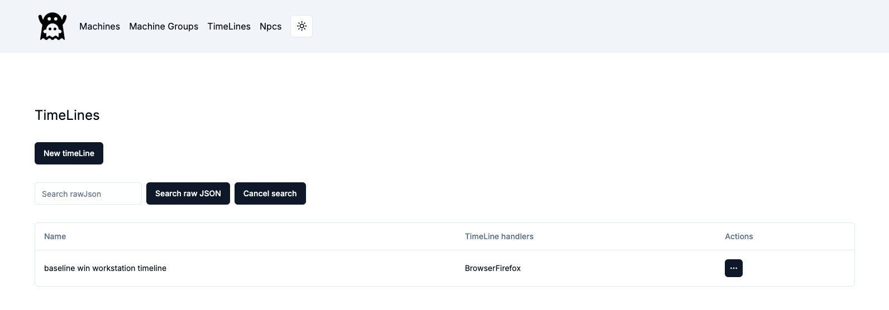
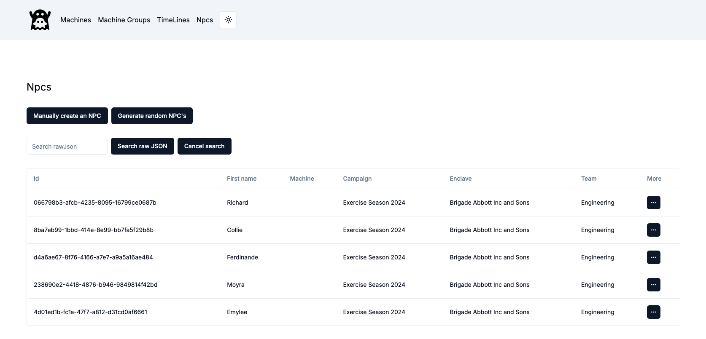

# GHOSTS UI

A UI for the GHOSTS API, providing interfaces for:

- Viewing and managing machines and machine groups controlled by the GHOSTS API
- Creating and managing timeLines that we can then send to machines or machine groups
- Viewer for Npcs

For any machine or machine group, we can use the UI to deploy new timelines, or view activities. For machine groups, we can create or manage the machines in the group. For timelines, we can view the activities in the timeline, or deploy new activities. It also provides a management interface for timelines as well.

## Install

The easiest way to run the GHOSTS UI is to use Docker. The following is an example we would add to the ghosts `docker-compose.yml` file that will run the GHOSTS UI and the GHOSTS API together:

```yaml
ghostsui:
    image: dustinupdyke/ghosts-ui
    container_name: ghosts-ui
    ports:
      - '8080:8080'
    networks:
      - ghosts-network
    environment:
      GHOSTS_API_URL: http://ghosts-api:5000
```

## Functions

This first screen is part of the user interface for managing machines within a network simulation or exercise environment, likely related to the GHOSTS framework or a similar system. 

### Machines



Here's an explanation of the various elements seen here:

New Machine Button: This button allows you to create or add a new machine to the simulation environment.

Search raw JSON: This input field allows you to perform a search within the machine data using raw JSON queries. It provides a more advanced way to filter or find specific data points.

Machine List:

- Id: This column displays the unique identifier for each machine.
- Name: This column displays the name of the machine. In this case, it is labeled as string, which might be a placeholder or default value.
- Status: This column shows the current status of the machine. The status Down indicates that the machine is not currently active or reachable.

There are also functions to delete the machine, run a particular timeline on that machine, view its activity, or view its JSON representation.

### Machine Groups



New Machine Group Button: This button allows you to create or add a new machine group to the simulation environment. Machine groups can be used to collectively manage multiple machines with similar roles or functions.

Machine Group List:

- Id: This column displays the unique identifier for each machine group.

- Name: This column displays the name of the machine group. In this case, it is labeled as string-*, which might be a placeholder or default value, suggesting it is a pattern-based naming convention.

- View Machines (0): This button opens a view to see all the machines currently in this group. The number in parentheses indicates that there are currently no machines in this group.

- Add Machines (1): This button allows you to add machines to the group. The number in parentheses suggests that there is one machine that could be added or is pending addition to this group.

More (Three-dot Menu): This button likely provides additional options such as deleting a grouping, running a timeline on a group of machines, viewing their activity or JSON representation.

### Timelines



This screen is part of the user interface for managing timelines within a network simulation or exercise environment.

- Name: This column displays the name of each timeline. In the example shown, the timeline is named baseline win workstation timeline, which suggests it is a baseline or standard sequence of events for a Windows workstation.

- Timeline Handlers: This column shows the handler or the specific application/component associated with executing the timeline. In this case, the handler is BrowserFirefox, indicating that this timeline is likely related to actions performed in the Firefox browser.

Actions (Three-dot Menu): This button provides access to deleting or editing a timeline, or viewing its JSON representation.


### NPCs



This screen is part of the user interface for managing NPCs (Non-Player Characters) within a network simulation or exercise environment. 

Generate Random NPCs Button: This button allows you to generate NPCs automatically with random attributes. This can be useful for populating the environment quickly with varied NPCs.

NPC List:

- Id: This column displays the unique identifier for each NPC. The IDs are represented as UUIDs, which ensure that each NPC has a distinct identifier within the system.

- First Name: This column shows the first name of the NPC. In this case, the NPCs listed have names like Richard, Collie, Ferdinande, Moyra, and Emylee.

- Machine: This column likely shows the machine or environment to which the NPC is assigned. This association would define where or how the NPC interacts within the simulation.

- Campaign: This column indicates the campaign or scenario in which the NPC is participating. All NPCs listed are part of Exercise Season 2024, suggesting they are involved in the same simulation or training exercise.

- Enclave: This column shows the organization or unit to which the NPC belongs. In this case, all NPCs are part of Brigade Abbott Inc and Sons.

- Team: This column indicates the specific team within the enclave to which the NPC belongs. All NPCs listed are part of the Engineering team, which might define their role or tasks within the simulation.
