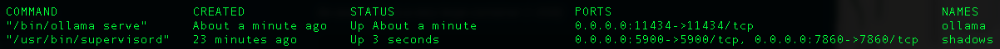
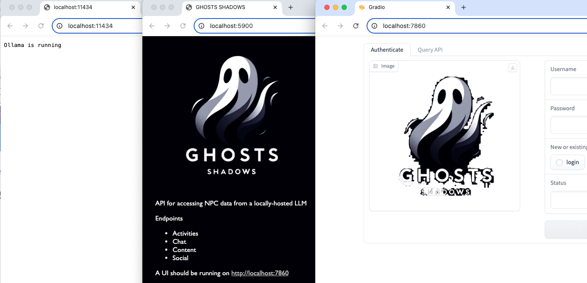

# Setting Up Shadows

_Updated on October 30, 2024_

Shadows provides access to a locally-hosted LLM for various GHOSTS agent purposes. It offers multiple interfaces:

-   A REST API: For GHOSTS agents.
-   A UI web interface: For testing and demo purposes.

The REST API contains endpoints for:

-   Activity: Answers the question of "what should an NPC do next?"
-   Chat: Provides content for an NPC to chat with a player or other NPC.
-   Excel Content: Provides content for documents related to spreadsheets.
-   Image Content: Provides content for documents related to images.
-   Lessons: Provides content related to educational materials or lessons.
-   Social: Provides content for an NPC to post on social media systems such as GHOSTS Socializer.
-   Web Content: Provides content for documents related to web pages.

## Prerequisites

If you are just looking to try out Shadows, you do not need any prerequistes other than Docker compose (see Step 2 of [Setting Up the GHOSTS API](installing-the-api.md)).

If you plan to use Shadows with Non-Player Character (NPC) clients, you should go ahead and complete the [installation for the GHOSTS API](installing-the-api.md) and [configured Grafana](./configuring-grafana.md) before moving on to Step 1 of this tutorial.

The following steps assume you are using docker for Ollama. Review the Notes at the end of this tutorial for setting up Ollama for Shadows without Docker.

## Step 1 &mdash; Ollama Container Setup

Pull (download) the latest Ollama Docker image

_Be aware this is a very large container (~800MB)_

```shell
docker pull ollama/ollama:latest
```

Run the container

```shell
docker run -d --name ollama \
  -p 11434:11434 \
  ollama/ollama:latest
```

**Explanation:**

-   `-p 11434:11434`: Maps port 11434 on your host to port 11434 in the container (Ollama's API port).
-   `ollama serve --port 11434` tells Ollama to serve its API on port 11434

## Step 2 &mdash; Shadows Container Setup

Pull (download) the latest Shadows image

_Be aware this is a very large container (~3GB)_

```shell
docker pull dustinupdyke/ghosts-shadows:latest
```

Set the environment variable for Shadows to use the Ollama API you configured in Step 1.

```shell
export GHOSTS_OLLAMA_URL=http://localhost:11434
```

Run the container

```shell
docker run -d --name shadows \
  -p 5900:5900 \
  -p 7860:7860 \
  -e GHOSTS_OLLAMA_URL=http://localhost:11434 \
  dustinupdyke/ghosts-shadows
```

**Explanation:**

-   -p 5900:5900: Maps port 5900 on your host to port 5900 in the container (Shadows API).
-   -p 7860:7860: Maps port 7860 on your host to port 7860 in the container (Shadows UI).
-   -e GHOSTS_OLLAMA_URL=http://localhost:11434: Passes the Ollama URL to Shadows.

## Step 3 &mdash; Accessing and Testing the Services

Check that both the Ollama and Shadows containers are running:

```shell
docker ps -a
```



If the either container is not running, review its logs with docker

```shell
docker logs ollama
docker logs shadows
```

Access each service with

-   Ollama: http://localhost:11434
-   Shadows API: http://localhost:5900 for GHOSTS NPC access
-   Shadows UI: http://localhost:7860 for testing and demos



### Troubleshooting

**Network Configuration**: Ensure that the Docker containers for Ollama and Shadows are on the same network. By default, Docker containers on the same host can communicate using localhost, but you can create a Docker network if needed.

```shell
docker network create ghosts-network
docker run -d --name ollama --network ghosts-network -p 11434:11434 ollama/ollama:latest
docker run -d --name shadows --network ghosts-network -p 5900:5900 -p 7860:7860 -e GHOSTS_OLLAMA_URL=http://ollama:11434 dustinupdyke/ghosts-shadows
```

In this setup: - Replace `http://localhost:11434` with `http://ollama:11434` to refer to the Ollama container by name within the Docker network.

**Port Conflicts**: Ensure that ports specified above (5900, 7860, and 11434) are not in use by other applcations

## Step 4 &mdash; Configuring the Docker Compose File

Rather than building the containers individually, you can add them to a docker compose file to run everything you need for simulations with GHOSTS all at once.

You can create a new docker-compose file for starting just these two containers using the following configuration, or you can add the two service configurations to the existing docker-compose.yml file you downloaded as part of [installing the GHOSTS API](./installing-the-api.md).

```yml
# Filename: docker-compose.yml
services:
    ollama:
        image: ollama/ollama:latest
        container_name: ollama
        ports:
            - "11434:11434"
        command: serve
        networks:
            - ghosts-network

    shadows:
        image: dustinupdyke/ghosts-shadows
        container_name: shadows
        ports:
            - "5900:5900"
            - "7860:7860"
        environment:
            - GHOSTS_OLLAMA_URL=http://ollama:11434
        networks:
            - ghosts-network
        depends_on:
            - ollama

networks:
    ghosts-network:
        driver: bridge
```

Note, you will need to delete the existing containers you created in steps 1 and 2 in order to use the same names with docker-compose.

```
docker rm ollama
docker rm shadows
```

You can then use docker-compose to build the new containers all at once.

```
docker-compose up -d
```

You should at this point be able to again access the three APIs listed in Step 3.

### Docker-Compose Commands

Some useful docker-compose commands are

-   `docker-compose down` - stops the services
-   `docker-compose up -d --build` - rebuilds the servcies
-   `docker-compose ps` - check container status
-   `docker-compose logs ollama` - show logs for the ollama container
-   `docker-compose logs shadows` - show logs for the shadows container

## Notes: Running Shadows Without Docker

If you prefer to run Shadows on bare metal, follow these steps:

### Get Ollama Up and Running

In separate terminal windows, execute the following commands:

Create and Run Models:

```shell
cd content-models/activity
ollama create activity

cd ../chat
ollama create chat

cd ../excel_content
ollama create excel_content

cd ../img_content
ollama create img_content

cd ../lessons
ollama create lessons

cd ../social
ollama create social

cd ../web_content
ollama create web_content
```

Run the API and UI Servers:

```shell
python api.py
python ui.py
```

### Run Multiple Models

Eventually, Ollama will serve multiple models concurrently. Use the following loop to set up and start models:

```shell
cd content-models/activity
ollama create activity

cd ../chat
ollama create chat

cd ../excel_content
ollama create excel_content

cd ../img_content
ollama create img_content

cd ../lessons
ollama create lessons

cd ../social
ollama create social

cd ../web_content
ollama create web_content

ollama serve
```

### Expose Ollama Beyond Localhost

If you want Ollama to be available beyond localhost, use:

```shell
OLLAMA_HOST=0.0.0.0:11434 ollama serve
```

Now Ollama is running all the models concurrently. The API server provides access to each model.
