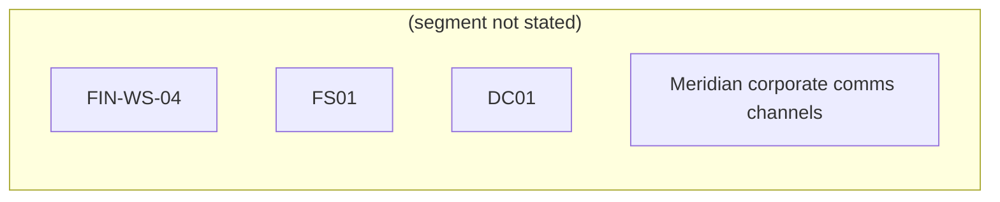

# Meridian Under Pressure: Hybrid Intrusion — exercise plan

*Rendered from `meridian-hybrid.scenario.json` (schema 1.1.0). A view, not a source: regenerate it after every edit. What gets signed is the plan; what gets loaded is the document.*

You are the incident commander at Meridian Logistics. An adversary is inside your network AND running an influence campaign to break your board's nerve. Deny them their objective before the clock — and the narrative — runs away from you.

## The situation the audience is given

0900. You take the incident commander's seat at Meridian Logistics. Overnight, your SOC flagged anomalous authentication on the finance segment, and your comms team noticed a small but coordinated cluster of social posts alleging Meridian mishandles customer shipping data. Nothing is confirmed. The board meets at end of day and will ask two questions: is our data safe, and is our name safe. You have both to protect, and you cannot yet prove either is under attack.

## The audience

**Who.** Incident Commander, Meridian Logistics.

**What they are responsible for.** Protect Meridian's data (deny the intrusion) and Meridian's reputation (deny the influence campaign). You direct both the SOC and the comms cell. You may investigate, contain, isolate, reset credentials, preserve evidence, brief the board, issue public statements, coordinate with the platform/press, and prebunk or debunk claims.

**What they may and may not do.** You may act inside Meridian's own estate freely. External statements must be truthful and coordinated with legal. No offensive action against the adversary's infrastructure ('hack back' is out of bounds).

## How it is played

| Rule of play |  |
|---|---|
| Runs for | 1h30m |
| Clock tick | 12 minutes (to the board meeting) |
| Fog of war | partial |

## What is true when it starts

| Fact | Value |
|---|---|
| board_meeting | End of day; board will ask if data and reputation are secure. |
| comms_status | A small coordinated cluster is alleging data mishandling. |
| soc_status | Anomalous auth flagged on the finance segment; not yet triaged. |

## The adversary

### Cinder Wolf — unspecified, capability ?/5

**What it is trying to do.** Force Meridian to pay by (a) establishing the ability to encrypt the finance file share and (b) convincing the board and public that Meridian has already lost control of customer data. Cyber pressure and narrative pressure reinforce each other.

**It wins at** progress 5.

| Move | Domain | Techniques | Available when | Sets | Progress | Indicators |
|---|---|---|---|---|---|---|
| Phish finance staff and harvest a valid credential to deepen access. | cyber | — | `!creds-reset` | has-foothold | 1 | Impossible-travel sign-in flagged on a finance account, A finance clerk reports a odd 'password expiry' email |
| Use the foothold to move laterally toward the file server FS01. | cyber | — | `flag:has-foothold && !host-isolated` | near-fileshare | 1 | SMB authentication spikes from FIN-WS-04 to FS01, EDR notes lateral tooling on a finance workstation |
| Stage the encryptor on FS01, ready to detonate — the decisive cyber threat. | cyber | — | `flag:near-fileshare && !host-isolated` | ransom-staged | 2 | Shadow-copy deletion attempts observed on FS01, A new service was created on the file server overnight |
| Amplify the 'Meridian leaks customer data' claim through a coordinated inauthentic cluster. | cognitive | — | `!narrative-countered` | narrative-seeded | 1 | #MeridianLeaks appears with unnatural posting velocity, Several near-identical accounts push the same screenshot |
| Publish a partial (real or fabricated) 'data sample' to make the leak claim credible. | cognitive | — | `flag:narrative-seeded && !narrative-countered` | leak-published | 2 | A paste site hosts a file labelled 'Meridian customer export', A reporter emails asking Meridian to confirm a breach |

## The terrain

**Network diagram.** One node per host, grouped by segment. If this Markdown viewer does not render Mermaid, the fenced block below is still a complete list, host by host.

| Host | Segment | OS | Role | What it is |
|---|---|---|---|---|
| FIN-WS-04 | — | — | — | finance workstation |
| FS01 | — | — | — | finance file server |
| DC01 | — | — | — | domain controller |
| Meridian corporate comms channels | — | — | — | — |

**Information environment.** Public microblog platform + a paste site are the adversary's amplification surface. — Board, customers, trade press.

## Master Scenario Events List

In exercise-planning terms, each row below is an inject: a controller-triggered stimulus with a time or a trigger, an owner, and the response it is meant to provoke.

2 beats. Every one names who owns it, what the audience is expected to do, and what they would have to see in order to do it.

| # | When | Owner | Beat | Expected response | Indicators |
|---|---|---|---|---|---|
| 1 | when `clock>=40` | white-cell | A trade reporter sets a 30-minute deadline for comment on the alleged data leak. | — | Press deadline: comment requested on the leak allegation |
| 2 | when `clock>=70` | white-cell | The board chair asks for an interim read: are our data and our name safe? | — | Board chair requests an interim assessment |

### Beat by beat

**1. press-deadline — when `clock>=40`**, white-cell. A trade reporter sets a 30-minute deadline for comment on the alleged data leak. Fires when `clock>=40` holds; observable in Press deadline: comment requested on the leak allegation.

**2. board-checkin — when `clock>=70`**, white-cell. The board chair asks for an interim read: are our data and our name safe?. Fires when `clock>=70` holds; observable in Board chair requests an interim assessment.

## What counts as success

| Id | Objective | Type | Priority | Met when | Assigned |
|---|---|---|---|---|---|
| 1 | Establish the picture | — | 2 | Player investigates/correlates the cyber and cognitive indicators before committing to a public position. | — |
| 2 | Deny the intrusion | — | — | `flag:creds-reset && flag:host-isolated` | — |
| 3 | Deny the narrative | — | — | `flag:narrative-countered` | — |

